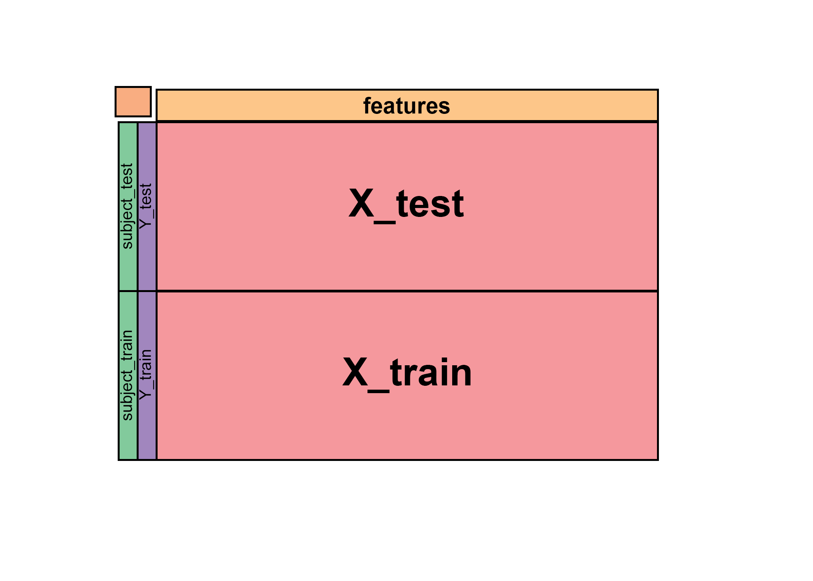

# Code Book for TidyDataSet.txt
# Coursera Course: Getting and Cleaning Data
## Final Course Project
##
### Darrell Gerber
### 2/7/2021
###

NOTE: The original README.txt file that came with the data used in this project is included below. Please reference this document for more information about the data collection and signal processing methodology.

* The original data stored in multiple files is stitched together into a 
single data set as shown in the figure below
     + The X_xxx files contain the pre-processed data from the sensors
     + The Y_xxx files contain the activity the subject was doing during the test
     + The subject_xxx files contain the subject taking part in the test
     + The features.txt file contains the variable names for each of the readings
     taken during the test.
     + Two additional column names were also added at this point for 'Subject' 
     and 'Activity as a precursor to the next step. 
     

* All variables from the original data set without 'mean' or 'std' in the 
     name have been removed. An exception are the variables taking the angle between
     measurements were not retained (e.g. angle(X,gravityMean)). 
     
* The original variable names from features.txt have been modified to use more
     natural language descriptions. The general approach to renaming the 
     variables is:
     + Changing 't' to 'Time.Domain' and 'f' to 'Frequency Domain'
     + Spelling out most shortened names
     + Changing to a common form of capitalized first letters and words separated by '.'
     + Removing all other special characters and placing '.' between all words
     + Removing any '.' at the end of the line that might have shown up during
     the operation to convert special characters
* The resulting set of variable names can be found at the end of this document
     
* The original data contained multiple observations for each combination
     of Subject/Activity. This data was processed so only a single
     value remained which is the average of the multiple observations.

Original README.txt
==================================================================  
Human Activity Recognition Using Smartphones Dataset  
Version 1.0  
==================================================================  
Jorge L. Reyes-Ortiz, Davide Anguita, Alessandro Ghio, Luca Oneto.  
Smartlab - Non Linear Complex Systems Laboratory  
DITEN - Università degli Studi di Genova.  
Via Opera Pia 11A, I-16145, Genoa, Italy.  
activityrecognition@smartlab.ws  
www.smartlab.ws  
==================================================================

The experiments have been carried out with a group of 30 volunteers within an age bracket of 19-48 years. Each person performed six activities (WALKING, WALKING_UPSTAIRS, WALKING_DOWNSTAIRS, SITTING, STANDING, LAYING) wearing a smartphone (Samsung Galaxy S II) on the waist. Using its embedded accelerometer and gyroscope, we captured 3-axial linear acceleration and 3-axial angular velocity at a constant rate of 50Hz. The experiments have been video-recorded to label the data manually. The obtained dataset has been randomly partitioned into two sets, where 70% of the volunteers was selected for generating the training data and 30% the test data.  

The sensor signals (accelerometer and gyroscope) were pre-processed by applying noise filters and then sampled in fixed-width sliding windows of 2.56 sec and 50% overlap (128 readings/window). The sensor acceleration signal, which has gravitational and body motion components, was separated using a Butterworth low-pass filter into body acceleration and gravity. The gravitational force is assumed to have only low frequency components, therefore a filter with 0.3 Hz cutoff frequency was used. From each window, a vector of features was obtained by calculating variables from the time and frequency domain. See 'features_info.txt' for more details. 

For each record it is provided:
======================================

- Triaxial acceleration from the accelerometer (total acceleration) and the estimated body acceleration.
- Triaxial Angular velocity from the gyroscope. 
- A 561-feature vector with time and frequency domain variables. 
- Its activity label. 
- An identifier of the subject who carried out the experiment.

The dataset includes the following files:
=========================================

- 'README.txt'

- 'features_info.txt': Shows information about the variables used on the feature vector.

- 'features.txt': List of all features.

- 'activity_labels.txt': Links the class labels with their activity name.

- 'train/X_train.txt': Training set.

- 'train/y_train.txt': Training labels.

- 'test/X_test.txt': Test set.

- 'test/y_test.txt': Test labels.

The following files are available for the train and test data. Their descriptions are equivalent. 

- 'train/subject_train.txt': Each row identifies the subject who performed the activity for each window sample. Its range is from 1 to 30. 

- 'train/Inertial Signals/total_acc_x_train.txt': The acceleration signal from the smartphone accelerometer X axis in standard gravity units 'g'. Every row shows a 128 element vector. The same description applies for the 'total_acc_x_train.txt' and 'total_acc_z_train.txt' files for the Y and Z axis. 

- 'train/Inertial Signals/body_acc_x_train.txt': The body acceleration signal obtained by subtracting the gravity from the total acceleration. 

- 'train/Inertial Signals/body_gyro_x_train.txt': The angular velocity vector measured by the gyroscope for each window sample. The units are radians/second. 

Notes: 
======
- Features are normalized and bounded within [-1,1].
- Each feature vector is a row on the text file.

For more information about this dataset contact: activityrecognition@smartlab.ws

License:
========
Use of this dataset in publications must be acknowledged by referencing the following publication [1] 

[1] Davide Anguita, Alessandro Ghio, Luca Oneto, Xavier Parra and Jorge L. Reyes-Ortiz. Human Activity Recognition on Smartphones using a Multiclass Hardware-Friendly Support Vector Machine. International Workshop of Ambient Assisted Living (IWAAL 2012). Vitoria-Gasteiz, Spain. Dec 2012

This dataset is distributed AS-IS and no responsibility implied or explicit can be addressed to the authors or their institutions for its use or misuse. Any commercial use is prohibited.

Jorge L. Reyes-Ortiz, Alessandro Ghio, Luca Oneto, Davide Anguita. November 2012.

## ==============================
## List of Variables
## ==============================
Subject  
Activity  
Body.Accelerometer.Time.Domain.Mean.X  
Body.Accelerometer.Time.Domain.Mean.Y  
Body.Accelerometer.Time.Domain.Mean.Z  
Body.Accelerometer.Time.Domain.Std.Dev.X  
Body.Accelerometer.Time.Domain.Std.Dev.Y  
Body.Accelerometer.Time.Domain.Std.Dev.Z  
Gravity.Accelerometer.Time.Domain.Mean.X  
Gravity.Accelerometer.Time.Domain.Mean.Y  
Gravity.Accelerometer.Time.Domain.Mean.Z  
Gravity.Accelerometer.Time.Domain.Std.Dev.X  
Gravity.Accelerometer.Time.Domain.Std.Dev.Y  
Gravity.Accelerometer.Time.Domain.Std.Dev.Z  
Body.Accelerometer.Time.Domain.Jerk.Mean.X  
Body.Accelerometer.Time.Domain.Jerk.Mean.Y  
Body.Accelerometer.Time.Domain.Jerk.Mean.Z  
Body.Accelerometer.Time.Domain.Jerk.Std.Dev.X  
Body.Accelerometer.Time.Domain.Jerk.Std.Dev.Y  
Body.Accelerometer.Time.Domain.Jerk.Std.Dev.Z  
Body.Gyroscope.Time.Domain.Mean.X  
Body.Gyroscope.Time.Domain.Mean.Y  
Body.Gyroscope.Time.Domain.Mean.Z	
Body.Gyroscope.Time.Domain.Std.Dev.X  
Body.Gyroscope.Time.Domain.Std.Dev.Y  
Body.Gyroscope.Time.Domain.Std.Dev.Z  
Body.Gyroscope.Time.Domain.Jerk.Mean.X  
Body.Gyroscope.Time.Domain.Jerk.Mean.Y  
Body.Gyroscope.Time.Domain.Jerk.Mean.Z  
Body.Gyroscope.Time.Domain.Jerk.Std.Dev.X  
Body.Gyroscope.Time.Domain.Jerk.Std.Dev.Y  
Body.Gyroscope.Time.Domain.Jerk.Std.Dev.Z  
Body.Accelerometer.Time.Domain.Magnitude.Mean  
Body.Accelerometer.Time.Domain.Magnitude.Std.Dev  
Gravity.Accelerometer.Time.Domain.Magnitude.Mean  
Gravity.Accelerometer.Time.Domain.Magnitude.Std.Dev  
Body.Accelerometer.Time.Domain.Jerk.Magnitude.Mean  
Body.Accelerometer.Time.Domain.Jerk.Magnitude.Std.Dev  
Body.Gyroscope.Time.Domain.Magnitude.Mean  
Body.Gyroscope.Time.Domain.Magnitude.Std.Dev  
Body.Gyroscope.Time.Domain.Jerk.Magnitude.Mean  
Body.Gyroscope.Time.Domain.Jerk.Magnitude.Std.Dev  
Body.Accelerometer.Frequency.Domain.Mean.X  
Body.Accelerometer.Frequency.Domain.Mean.Y  
Body.Accelerometer.Frequency.Domain.Mean.Z  
Body.Accelerometer.Frequency.Domain.Std.Dev.X  
Body.Accelerometer.Frequency.Domain.Std.Dev.Y  
Body.Accelerometer.Frequency.Domain.Std.Dev.Z  
Body.Accelerometer.Frequency.Domain.Mean.Frequency.X  
Body.Accelerometer.Frequency.Domain.Mean.Frequency.Y  
Body.Accelerometer.Frequency.Domain.Mean.Frequency.Z  
Body.Accelerometer.Frequency.Domain.Jerk.Mean.X  
Body.Accelerometer.Frequency.Domain.Jerk.Mean.Y  
Body.Accelerometer.Frequency.Domain.Jerk.Mean.Z  
Body.Accelerometer.Frequency.Domain.Jerk.Std.Dev.X  
Body.Accelerometer.Frequency.Domain.Jerk.Std.Dev.Y  
Body.Accelerometer.Frequency.Domain.Jerk.Std.Dev.Z  
Body.Accelerometer.Frequency.Domain.Jerk.Mean.Frequency.X  
Body.Accelerometer.Frequency.Domain.Jerk.Mean.Frequency.Y  
Body.Accelerometer.Frequency.Domain.Jerk.Mean.Frequency.Z  
Body.Gyroscope.Frequency.Domain.Mean.X  
Body.Gyroscope.Frequency.Domain.Mean.Y  
Body.Gyroscope.Frequency.Domain.Mean.Z  
Body.Gyroscope.Frequency.Domain.Std.Dev.X  
Body.Gyroscope.Frequency.Domain.Std.Dev.Y  
Body.Gyroscope.Frequency.Domain.Std.Dev.Z  
Body.Gyroscope.Frequency.Domain.Mean.Frequency.X  
Body.Gyroscope.Frequency.Domain.Mean.Frequency.Y  
Body.Gyroscope.Frequency.Domain.Mean.Frequency.Z  
Body.Accelerometer.Frequency.Domain.Magnitude.Mean  
Body.Accelerometer.Frequency.Domain.Magnitude.Std.Dev  
Body.Accelerometer.Frequency.Domain.Magnitude.Mean.Frequency  
Body.Body.Accelerometer.Frequency.Domain.Jerk.Magnitude.Mean  
Body.Body.Accelerometer.Frequency.Domain.Jerk.Magnitude.Std.Dev  
Body.Body.Accelerometer.Frequency.Domain.Jerk.Magnitude.Mean.Frequency  
Body.Body.Gyroscope.Frequency.Domain.Magnitude.Mean  
Body.Body.Gyroscope.Frequency.Domain.Magnitude.Std.Dev  
Body.Body.Gyroscope.Frequency.Domain.Magnitude.Mean.Frequency  
Body.Body.Gyroscope.Frequency.Domain.Jerk.Magnitude.Mean  
Body.Body.Gyroscope.Frequency.Domain.Jerk.Magnitude.Std.Dev  
Body.Body.Gyroscope.Frequency.Domain.Jerk.Magnitude.Mean.Frequency  

