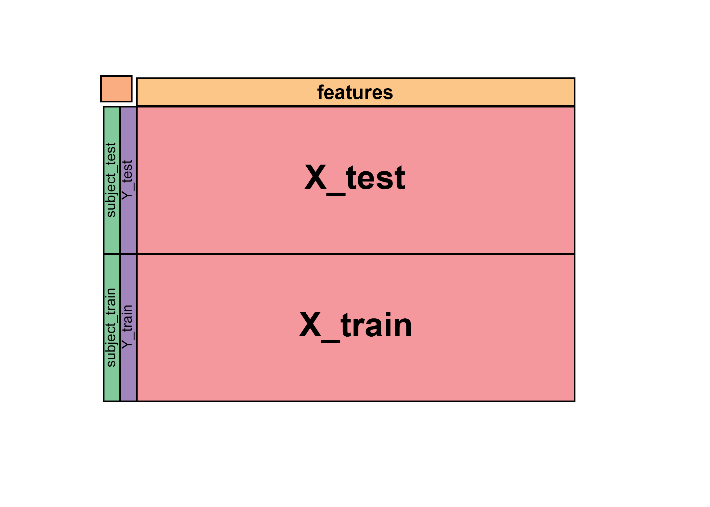

# Coursera Course: Getting and Cleaning Data
## Final Course Project
##
### Darrell Gerber
### 2/7/2021
###
  
#### Requirements:  
1. Merge the training and the test sets to create one data set.  
2. Extract only the measurements on the mean and standard deviation for
   each measurement.  
3. Use descriptive activity names to name the activities in the data set  
4. Appropriately labels the data set with descriptive variable names.  
5. From the data set in step 4, creates a second, independent tidy data set
   with the average of each variable for each activity and each subject.  
Data Source:  
https://d396qusza40orc.cloudfront.net/getdata%2Fprojectfiles%2FUCI%20HAR%20Dataset.zip[^1]     
  
#### Key Repository Files:  
README.md -- This file  
CodeBook.md -- Description of the original data files and all operations to
          create a tidy data set ready for further analysis.  
run_analysis.R -- R Script file with all operations   
TidyDataSet.txt -- The final data file made tidy and ready for further analysis
  
#### Notes to Reviewers: 
* The data set was downloaded and extracted into the Raw Files folder in the
project directory.
     + The subdirectory structure was maintained as is from the zip file
     + The key files loaded into the script were  
          - features.txt
          - activity_labels.txt
          - X_test.txt
          - Y_test.txt
          - Subject_test.txt
          - X_train.txt
          - Y_train.txt
          - Subject_train.txt
* Once loaded, the data sets were stitched together into a single data set
     + The data from the files is stitched together in a single data.frame
     as shown in the figure below
          - The X_xxx files contain the pre-processed data from the sensors
          - The Y_xxx files contain the activity the subject was doing during the test
          - The subject_xxx files contain the subject taking part in the test
          - The features.txt file contains the variable names for each of the readings
          taken during the test.
     + features is added as the column names of the data.frame instead of adding 
     another row to the data.frame. Adding as a row would mix character and numbers
     data types and make it more difficult analyze later (i.e. less tidy)
     + Two additional column names were also added at this point for 'Subject' 
     and 'Activity as a precursor to the next step. 
     + The stitched together data is stored in the data.frame, `combinedData`
     

* Removed all unneeded variables
     + The directions were somewhat ambiguous so I kept only those variables
     that had 'mean' or 'std' in the name...
     + ...with the exception that the variables taking the angle between
     measurements were not retained (e.g. angle(X,gravityMean)). They contain
     mean in the title but are an angle calculation between two vectors, one 
     of which is an averaged vector.
     + This smaller dataset is stored in a new data.frame, `trimmedData`
     
* The Activity codes are replaced by the plain language labels contained in
     activity_labels.txt using a lookup table.

* The general approach to renaming the variables to more understandable terms was:
     + Changing 't' to 'Time.Domain' and 'f' to 'Frequency.Domain'
     + Spelling out most shortened names
     + Changing to a common form of capitalized first letters and words separated by '.'
     + Removing all other special characters and placing '.' between all words
     + Removing any '.' at the end of the line that might have shown up during
     the operation to convert special characters
     
* The operation to find the average of each variable for each activity and each 
     subject uses several functions from the dplyr library via piped commands.
     
     ```{r} 
     meanTrimmedData <- trimmedData %>% arrange( Subject, Activity) %>%  
     group_by(Subject, Activity) %>%   
     summarise(across(.cols = !matches("Activity"), .fns = mean,   
                      .groups = "keep"))
     ```
     + `arrange()` orders the 'Subject' and 'Activity' columns to be alphabetical
     (just to be a little more tidy)
     + `group_by()` groups together all of the similar Subject/Activity pairs
     + `summarize()` boils down each Subject/Activity pair to a summary value
     + `across()` is the summary function used by `summarize()`. `across()` calls the
     `mean()` function across each column in the data set. The exception is the
     "Activity" column because it is another label. 
     + The resulting new dataset is stored in `meanTrimmedData`

* The final tidy dataset is stored as the file 'TidyDataSet.txt'. This file is
     saved as part of this repository for review. It can also be loaded into R
     by `data <- read.table(file = "TidyDataSet.txt", header = TRUE, quote = "")` 
     
[^1]: Davide Anguita, Alessandro Ghio, Luca Oneto, Xavier Parra and Jorge L. Reyes-Ortiz. Human Activity Recognition on Smartphones using a Multiclass Hardware-Friendly Support Vector Machine. International Workshop of Ambient Assisted Living (IWAAL 2012). Vitoria-Gasteiz, Spain. Dec 2012 This dataset is distributed AS-IS and no responsibility implied or explicit can be addressed to the authors or their institutions for its use or misuse. Any commercial use is prohibited.
